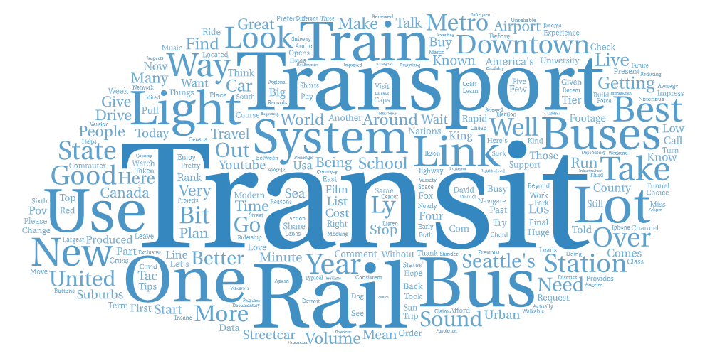

<!DOCTYPE html>
<html lang="en">

# YoutubeWordCloud
Lab2: Word Clouds Based on Youtube Web Crawlers
Wyatt Stanley
Geog358

<h3>
    North American/Seattle WA Word Cloud:
</h3>
Located in Assets Folder.

<h3>
    Europe/Zurich CH Word Cloud:
</h3>
Located in Assets Folder.

<h3>
    Describe the topic as well as the parameters you have used for search.
</h3>

In this project I aimed to compare the perception of public transportation in North America vs. Europe. America is known for having poor public transportation infastructure while Europe is known for exelent public transportation. For the most accurate searches I wanted to find information on each contries city with the best public transportation as well as the country as a whole. For the North American web crawler search I used two prompts, the first used the words "North", "America", "Public", Transportation", and the second was was based on Seattle which was ranked as the city with the best public transportation in the USA. For that search I used the words "Seattle", "Washington", "Public", "Transportation". For the European web crawler search I used the city Zurich in Swizerland becasue it was ranked to have the best public transportation in Europe. For Zurich I used the words "Zurich", "Swizerland", "Public", "Transportation". For Europe as a whole I used the words "Europe", "Public", "Transportation". Once I collected the data I deleted all the words I used for the search from the word cloud and I also deleated all but a few words that only showed up once. I did this because I didn't want the clouds to make up mostly the words I searched for or words that werent trends in data. 

<h3>
    Why do you want to make this comparison?
</h3>

I wanted to make this comparison to see if there is a clear difference of perception based on Youtube. From my own experiece there are a lot of people in the United States who want public transportation infastructer to be improved while there are many people who dont care for public transportation and prefere driving. In Europe, trains and other forms of public transportation are more widespread and are more publicly accepted. I was curious to see if this was obvious through Youtube word trends.

<h3>
    Compare the word clouds and discuss the difference or similarity among the word clouds.
</h3>

The word clouds are very similar when only obseving the largest words. The biggest word for North America is "Transit" and the biggest word for Europe is "Transport". Both word clouds also have words like "Bus", "Train", and "Rail". There are differences in the largerest words that are interesting but don't address the quality of the survices. An example of this is that one of the largest words for Europe is "Train" but is "Bus" for North America, this is because they represent the most common forms of public transportation in each area. These clouds only resprest descriptive words once you start looking at the smaller words. Europe has some descriptive words such as "Love", "Easy", "Enjoy", "Special", "Excited". North America has workds like "Good", "Great", and "Impress" but also has words like "Suck" and "Unreliable". 

<h3>
    What might be the possible reasons for the patterns you observed?
</h3>

The reason the large words are not descriptive is because my seaches were for public transportation in certain places. Words like "Transport", "Transit", "Bus", and "Train" come up fist because they are most related to my searches. The positive reviews for European and Zurich public transportation makes sense becasue these areas are known for their transportation, I wasn't expecting any negative feedback based on those searches. Even though Seattle was ranked to have the best public transportation in the U.S. I wasn't expecting the positive feedback from these searches. I was only able to find two negative words in the entire word cloud.

<h3>
    How your research could be improved in the future?
</h3>

I think that my search could be improved by adding more locations. I think I could have searched multiple cities or more countries. I wanted to search by Europe against just the United States but because Europe includes so many countries I thought it would be best to search it in comparison to North America. I wonder if using the key word "United States" or "America" would have made a difference.

<h3>
    Was there anything from the map or data that is different from your expectation before the exercise, or anything that stands out to you?
</h3>

I was suprised that the searches for North American Public Transportation weren't worse. When I searched these same key words in the Google search bar I recieved very negative videos in regard to North American public transportation. I was expecting this to be reflected in the words that showed up in the word clouds.

CSV Files:
<a href="assets/europe.csv">Europe</a>
<a href="assets/zurich.csv">Zurich</a>
<a href="assets/northamerica.csv">North America</a>
<a href="assets/Seattle.csv">Seattle</a>

